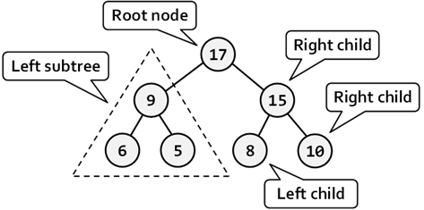
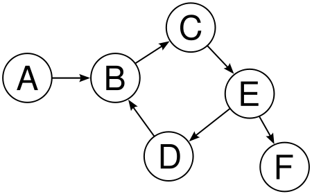
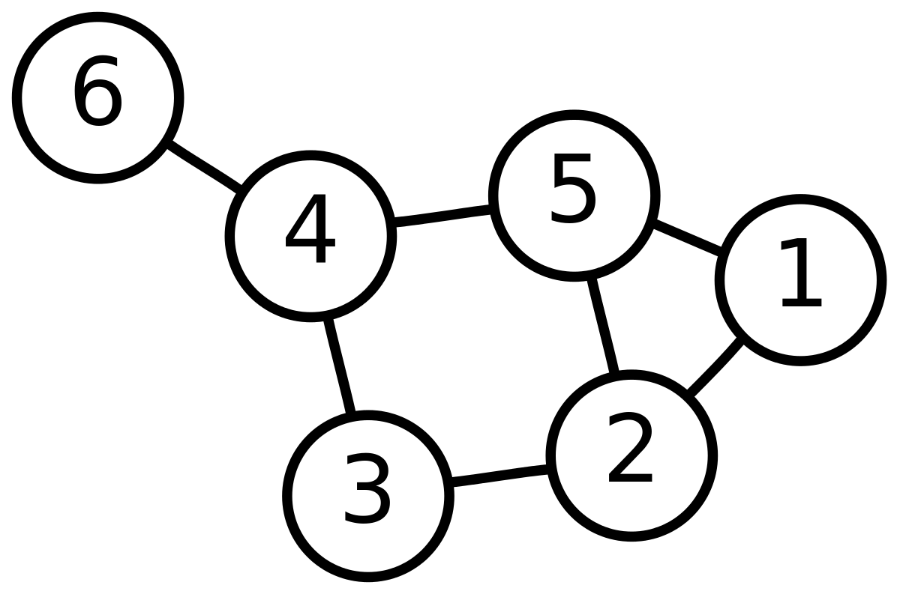

# Data Structures
### This was created during my time as a [Code Chrysalis](https://codechrysalis.io) Student

## Table of Contents

1.  [Introduction](#introduction)
1.  [Overview of Topics](#overview-of-topics)
1.  [Environment](#environment)
    1.  [Installing Dependencies](#installing-dependencies)
1.  [Objectives & Instructions](#objectives-and-instructions)
    1.  [Basic Requirements](#basic-requirements)
    1.  [Medium Requirements](#medium-requirements)
    1.  [Advanced Requirements](#advanced)
1.  [Resources](#resources)
1.  [Contributing](#contributing)

## Introduction

In the wild, multiple data structures are combined to create data bases, execute your code, and map you to the right path when you type "www.example.com" into the browser. However, before we dive into more complex technologies, we will start with the foundational data structures.

As engineers, we are working with various data that must be stored, accessed, sorted, and presented in a UI and more. Even the code itself, that we write is simply data, which is parsed and arranged into a data structure so that it can be optimized and executed. The content in this exercise is foundational knowledge for all great software engineers not only to succeed at technical interviews but also to make informed decisions about software and deepening your understanding of how things work under the hood.

In this exercise, you will implement common data structures using JavaScript. We recommend that you follow these steps when learning a new data structure. There is no perfect data structure solution, so be mindful of what problems each data structure is best suited to solve as well as its limitations.

1.  Create a mental model
    - Draw it out
    - Sketch out the API with the basic operations
      - Typical operations are add, remove, lookup/find, and update but may vary by data structure.
    - Read the tests to form a clearer picture
1.  Build it
    - Pseudocode the implementation
    - Walk through your pseudocode thoroughly with an example
    - Code it
    - Consider edge cases and make sure they are handled
1.  Use it
    - Put your data structure to work!
    - Write some more tests that will check for greater edge cases
    - Pair it with an algorithm if needed
1.  Analyze it
    - What is the time complexity?
    - How can you optimize?

## Overview of Topics

### Linked Lists


A linked list is a linear data structure that is very similar to an array. An array stores it's data in a contiguous block of memory, while the data in a linked list is connected with a pointer to the next element.

#### Why Linked List

Arrays can be used to store linear data of similar types, but insertion and removal from anywhere except the end of the array can be very expensive because you need to shift the entire data structure to accommodate the index number updates.

For example we maintain a sorted list of IDs in an array, `id`:

`const id = [1000, 1010, 1050, 2000, 2040];`

If we insert a new ID 1005 and need to maintain the sorted order, we have to move all the elements after 1000 (excluding 1000) up one index location.
Deletion is also expensive with arrays until unless some special techniques are used. For example, to delete 1010 in `id`, everything after 1010 has to be shifted down one index.

#### Linked List Advantages (over arrays)

1.  Dynamic size (this matters more in languages other than JS)
1.  Ease of insertion/deletion

#### Drawbacks

- Random access is not allowed We have to access elements sequentially starting from the first node. For example, `id[0]` is a constant time lookup in an array but is not possible in a linked list. You must traverse through the linked list to do a lookup.
- Extra memory space for the `next` pointer is required with each element of the list.

### Trees

If you have played with the DOM, you have already interacted with a tree data structure! Trees represent hierarchical data such as parent and child elements in the DOM. With trees, we extend the concept of the linked data structures we have covered before like linked list, stack, or a queue, which only have one relationship between nodes. Trees may have multiple relationships among its nodes and unlike arrays, linked lists, stack and queues, which are linear data structures, trees are hierarchical data structures.

#### Tree Vocabulary

The top-most node is called root of the tree. The elements that are directly under an element are called its children. The element directly above something is called its parent. Finally, elements with no children are called leaves.



#### Why Trees

- One reason to use trees might be because you want to store information that naturally forms a hierarchy. For example the DOM:


- Trees (with some ordering e.g., BST) provide moderate access/search (quicker than linked list and slower than arrays).
- Trees provide moderate insertion/deletion (quicker than arrays and slower than unordered linked lists).
- Like linked lists, trees don’t have an upper limit on number of nodes as nodes are linked using pointers.

#### Main applications of trees include

1.  Organize and manipulate hierarchical data, like the DOM
1.  Make information easy to search
1.  Manipulate sorted lists of data
1.  Router algorithms
1.  Form of a multi-stage decision-making, using decision trees
1.  Parsing syntax into ASTs, abstract syntax trees

#### Binary Tree

A tree whose elements have at most 2 children is called a binary tree. Since each element in a binary tree can have only 2 children, we typically name them the left and right child.

### Binary Search Trees

Binary search tree (BST) is a binary tree data structure which has the following properties:

1.  The left subtree of a node contains only nodes with keys less than the node’s key.
1.  The right subtree of a node contains only nodes with keys greater than the node’s key.
1.  The left and right subtree each must also be a binary search tree.
1.  There must be no duplicate nodes.


#### Why BST

BST is used when quick searching of an element (in log(n)) is required. The above properties of a BST provide an ordering among keys so that the operations like search, minimum and maximum can be done fast. If there is no ordering, then we may have to compare every key to search for a given key.

### Graphs

Graph is a data structure that consists of following two components:

1.  A finite set of vertices also called as nodes.
1.  A finite set of ordered pairs of the called an edge, which represents the relationship between the vertices. The edges may contain a direction and/or a weight/value/cost.



#### Why Graphs

Graphs are used to represent many real life applications. In particular graphs are often used to represent networks. The networks may include roads on a map, a circuit network, a network of holes in some porous material or a maze. Graphs are used in social networks like Facebook or Twitter. You may have even heard of Facebook graph search.

#### Facebook Example

If we think about Facebook as being a network of people and their friends, each person is represented with a vertex (or node). Each node is a structure and contains information like person id, name, gender and locale. Each vertex, which represent people in the Facebook graph has relationships with other people. These relationships with Facebook friends are the edges.

Following is an example undirected graph with 6 vertices.



#### Representing Graphs

Following two are the most commonly used representations of graph.

1.  Adjacency Matrix
1.  Adjacency List

There are other representations also like, Incidence Matrix and Incidence List. The choice of the graph representation is situation specific. It depends on the type of operations to be performed and ease of use. In this exercise we will represent the graph as an adjacency list.

Just like a linked list is a type of tree, a tree is a type of graph.

### Heaps

A Binary Heap is a Binary Tree with following properties:

1.  It’s a complete tree (All levels are completely filled except possibly the last level and the last level has all keys as left as possible). This property of Binary Heap makes them suitable to be stored in an array.
1.  A Binary Heap is either Min Heap or Max Heap. In a Min Binary Heap, the key at root must be minimum among all keys present in Binary Heap. The same property must be recursively true for all nodes in Binary Tree. Max Binary Heap is similar to Min Heap.

#### Why Heaps

A heap or a priority queue is used when the minimum or maximum element needs to be fetched in constant time.

#### Representing a Binary Heap?

A Binary Heap is a Complete Binary Tree. A binary heap is typically represented as array. Here is a diagram of a min-heap represented as a tree and how it would be stored as an array


#### Applications of Heaps

1.  Heap Sort: Heap Sort uses Binary Heap to sort an array in O(nLogn) time.
1.  Priority Queue: Priority queues can be efficiently implemented using Binary Heap because it supports insert(), delete() and extractmax(), decreaseKey() operations in O(logn) time.
1.  Graph Algorithms: The priority queues are especially used in Graph Algorithms like Dijkstra’s Shortest Path and Prim’s Minimum Spanning Tree.

### Hash Tables

A hash table stores key-value pairs and is made up of two components:

1.  A Hashing Function that creates a hash with the key that maps to a particular index.
1.  An array that stores the key-value pair.


#### Why Hash Tables

A hash table is used to retrieve, insert, and remove an value in constant time using a key. Along with its relative simplicity, this makes hash tables one of those most popular data structures.

You use hash tables whenever you use a JavaScript object, which is implemented as a hash table underneath the surface.

## Environment

### Installing Dependencies and Starting Up

To install dependencies:

```shell
npm install [OR] yarn install
```

## Objectives and Instructions

### Learning Objectives

- Be able to translate an abstract data structure concept into JavaScript code.
- Understand the basic interfaces and common operations of the following data structures:
  - linked list
  - tree
  - binary search tree
  - graph
  - hash table
  - heap
- Be able to analyze the runtime complexity of common operations of a data structure.
- Be able to understand the pros and cons of each data structure, as well as common use cases.

## Basic Requirements

Use the tests as your roadmap as you create classes for the following data structures. The tests will not always cover every case so make sure you fill in any missing tests as they arise. Existing tests might also make assumptions about your code, feel free to remove/change those assumptions, they are a guideline, not a requirement! They also intentionally don't cover all the cases, so please write your own tests, too!

**Don't attempt the extra credit until you have completed and ensured the testing was complete for the basic requirements for all the data structures.**

- [ ] `LinkedList`

  - [ ] `LinkedList` returns an instance of an ES6 class
  - [ ] `.appendToTail(value)` adds a new node to the tail and returns the new node
  - [ ] `.removeHead()` removes the head node of the linked list and returns removed head node
  - [ ] `.findNode(value)` returns first node that has a value matching what was passed in and returns null when no value is found
  - [ ] What are the time complexities?

- [ ] `Tree`

  - [ ] `Tree` returns an instance of an ES6 class
  - [ ] `.addChild(value)` adds a child to tree/subtree and returns the new child node (which should be a tree instance)
  - [ ] `.contains(value)` return true if value is in tree, false if not
  - [ ] `.remove(value)` removes the value from tree and returns the removed value. You may need to write tests for this.
  - [ ] What are the time complexities?

- [ ] `BinarySearchTree`

  - [ ] `BinarySearchTree` returns an instance of an ES6 class
  - [ ] `.insert(value)` inserts a value into the correct position within the tree and returns the tree (for chaining purposes)
  - [ ] `.contains(value)` returns true if the value is in the tree, false if not
  - [ ] `.traverseDepthFirstInOrder(callback)` invokes the callback for every node in a depth-first in-order (visit left branch, then current node, than right branch). Returns undefined.
  - [ ] What are the time complexities?

  > Note: In-Order traversal is most common type for binary trees. For binary search tree, this visits the nodes in ascending order (hence the name).

- `Graph`

  - [ ] `Graph` returns an instance of an ES6 class
  - [ ] `.addNode(value)` adds a node to graph with a primitive value. Returns undefined.
  - [ ] `.removeNode(value)` removes a node from graph and returns undefined.
  - [ ] `.contains(value)` returns boolean. Returns true if value is found in graph, false otherwise
  - [ ] `.addEdge(value1, value2)` returns undefined. Create connection between two nodes if they're both present in the graph
  - [ ] `.removeEdge(value1, value2)` returns undefined. Remove connection between two nodes
  - [ ] `.hasEdge(value1, value2)` returns boolean. Returns true if edge exists, false otherwise
  - [ ] What are the time complexities?

- [ ] `HashTable`
  - [ ] `HashTable` returns an instance of an ES6 class
  - [ ] `.insert(key, value)` stores the key value pair in the storage array. If the key already exists, replace the stored value with the new value. Use the hashing function to map the key to an integer and store the value at the corresponding index. Account for the possibility of collisions
  - [ ] `.retrieve(key)` returns the value associated with the key
  - [ ] `.remove(key)` removes the key and value from the storage array and returns a boolean if successful
  - [ ] What are the time complexities?

## Medium Requirements

- [ ] `Heap`
  - [ ] `Heap` returns an instance of an ES6 class
  - [ ] `insert(value)` adds a value to heap according to the shape and heap property and returns undefined
  - [ ] `removeMax()` removes the max value from the heap, reorder the heap, and returns the max value
  - [ ] What are the time complexities?

## Advanced Requirements

- [ ] `LinkedList`

  - [ ] `.forEach(callbackFn)` invokes the callback function with the value of each node and does not return anything.
  - [ ] `.print()` returns string with all values in list (ex: '0, 1, 2, 3')
  - [ ] `.insertHead(value)` inserts a new head node at the beginning of the list with the value passed in and returns the new head node.
  - [ ] `.insertAfter(refNode, value)` inserts the new node associated with value passed in after refNode and returns the new node
  - [ ] `.removeAfter(refNode)` removes the node after the refNode and returns the old node

- [ ] `Tree`

  - [ ] `.traverseDepthFirst(callback)` returns undefined. Invoke the callback for every node in a depth-first order.
  - [ ] `.traverseBreadthFirst(callback)` returns undefined. Invoke the callback for every node in a breadth-first order.

- [ ] `BinarySearchTree`

  - [ ] `.traverseBreadthFirst(callback)` invokes the callback for every node in a breadth-first order and returns undefined
  - [ ] `.traverseDepthFirstPreOrder(callback)` invoke the callback for every node in a depth-first pre-order (visits current node before its child nodes)
  - [ ] `.traverseDepthFirstPostOrder(callback)` invokes the callback for every node in a depth-first post-order (visit the current node after its child nodes) and returns undefined
  - [ ] `.checkIfFull()` returns true if every node has either zero or two children (no nodes have only one child) and false if the BST is not full
  - [ ] `.checkIfBalanced()` returns boolean if the BST is balanced. For this exercise, a BST is balanced if the minimum height and the maximum height differ by no more than 1. The height for a branch is the number of levels below the root.

- [ ] `Graph`

  - [ ] `forEach(callback)` returns undefined. Traverse the graph and invoke the passed callback once for each node. The callback function receives the following for each node: node value, node Neighbors, all nodes.
  - [ ] Implement traversal methods for depth-first and breadth-first traversal. The methods take a starting node and a callback that gets invoked for each node. The callback should receive two arguments: the node value and the distance (number of edges that separate the node from the starting node).

- [ ] `HashTable`
  - [ ] Resize the hash table:
    - [ ] If the count becomes greater than 75% of the table size, double the table size and redistribute the key/value pairs
    - [ ] If the count becomes less than 25% of the table size, cut the table size in half and redistribute the key/value pairs
  - [ ] Implement a hash table with a binary search tree.

## Resources

Harvard CS50 Data Structure Videos:

- [Intro to LinkedList](https://www.youtube.com/watch?v=5nsKtQuT6E8)
- [Intro to Trees and BST](https://www.youtube.com/watch?v=mFptHjTT3l8)
- [Intro to Graphs](https://www.youtube.com/watch?v=h2d9b_nEzoA)
- [Intro to Hash Tables](https://www.youtube.com/watch?v=h2d9b_nEzoA)
- [Intro Heaps](https://www.youtube.com/watch?v=t0Cq6tVNRBA)

## Contributing

Leave the below in the curriculum and delete this sentence.

See a problem? Can something be done better? [Contribute to our curriculum](mailto:hello@codechrysalis.io)!
